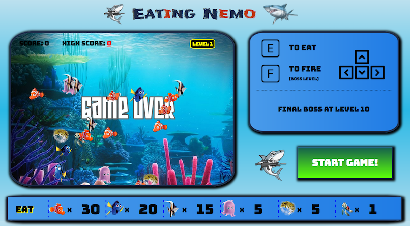
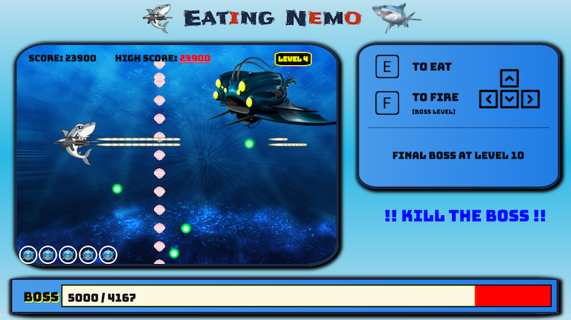

###Eating Nemo(README in progress)

####[Play The Game!](http://pauldkang.com/nemo/)
---

Eating Nemo is a single player game developed in plain JavasSript using the draw method to render the ```<canvas>``` element. 



Descriptions for game modes are shown before starting each level

 

The user controls the shark's movements with arrow keys. In regular mode, player must eat all the fish within 30 seconds. Remaining fish are listed below the game-screen, while the timer ticks on the right.


In boss mode, player must shoot down the enemy while dodging its attacks. Player is given 6 shark lives at the start of each level, and higher level bosses have more hp and projectiles.



####Code Example: Bullet creation, firing, and collision in Vanilla JS

Creating 100 bullet objects with a constructor and pushing them into an array
```javascript
var bullets = [];

function Bullet(x, y){
	this.x = x;
	this.y = y;
};

Bullet.prototype.icon = new Image();
Bullet.prototype.icon.src = "bullet.png";

for(var i = 0; i < 100; i++){
	bullets.push(new Bullet(0, 500))
};
```

Adding an event listener to create and set the index of ```keysDown``` array to be true when a key is pressed (```keyCode``` is equal to index of ```keysDown[]``` being changed) 
```javascript
var keysDown = [];

addEventListener('keydown', function(event){
	keysDown[event.keyCode] = true;
});
addEventListener('keyup', function(event){
	delete keysDown[event.keyCode];
});
```

Creating two functions that fire bullet objects in each half of ```bullets``` array (```fireBullet2()``` fires ```bullets[50]``` ~ ```bullets[99]```). Bullets are fired from current shark location and moved by increasing their locations' x coordinates.
```javascript
function fireBullet(){
	if(70 in keysDown){
		if(bulletCounter >= 49){bulletCounter = 0};
		bullets[bulletCounter].x = heroLocation.x;
		bullets[bulletCounter].y = heroLocation.y;
		bulletCounter++;
	}
};

function fireBullet2(){
	if(70 in keysDown)){
		bullets[(bulletCounter+50)].x = heroLocation.x;
		bullets[(bulletCounter+50)].y = heroLocation.y;
	}
};

var bulletSpeed = 15;

function moveBullet(){
	for(var i = 0; i < 100; i++){
		bullets[i].x += bulletSpeed;
	}
};
```

Creating a function to reduce boss's health bar when bullets collide.
```<div id="healthBar">``` is inside another ```<div>``` that stays a constant size regardless of changes to ```#healthBar```, giving it the effect of boss's health shrinking as damage is dealt
```javascript
var healthBarWidth
var damageDoneToBoss = 0

function bulletCollideBoss(){
	for(var i = 0; i < 100; i++){
		if((bullets[i].x <= boss1Location.x + 45) 
			&& (bullets[i].y <= boss1Location.y + 150)
			&& (bullets[i].x >= boss1Location.x - 45)
			&& (bullets[i].y >= boss1Location.y + 50)){

			damageDoneToBoss += (9-level/2);
			bullets[i].x = 800;
			bullets[i].y = 520;
			healthBarWidth = 100-(damageDoneToBoss/50)

			document.getElementById('healthBar').style.width = 
				healthBarWidth + '%';
			
			if(healthBarWidth >= 15){
				document.getElementById('healthBar').innerHTML = 
					'5000 / ' + (5000-damageDoneToBoss);
			}else if(healthBarWidth >= 0){
				document.getElementById('healthBar').innerHTML = 		
					5000-damageDoneToBoss;
			}else{
				healthBarWidth = 0;
			}
		}
	}
};
```

Drawing the bullets on ```<canvas>``` and calling bullet related functions
```javascript
function drawBullets(){
	for(var i = 0; i < 100; i++){
		context.drawImage(bullets[i].icon, bullets[i].x, bullets[i].y)
	}
};

function draw(){
	drawBullets();
	moveBullet();
	fireBullet();
	fireBullet2();
	bulletCollideBoss();
	requestAnimationFrame(draw);
};

draw();
```

